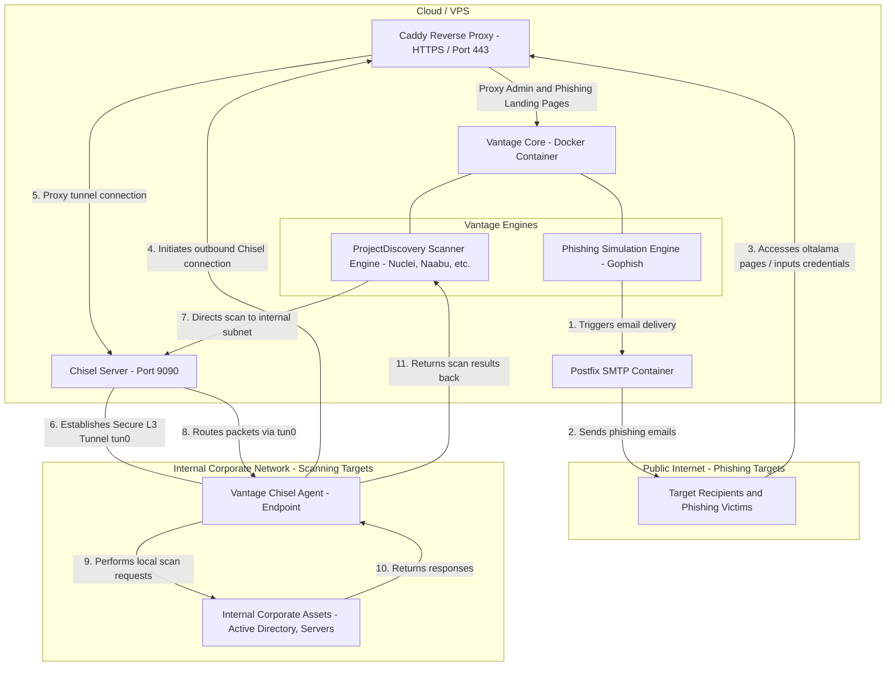

# Vantage (Gophish Security Operations Hub)

**Vantage** is an advanced fork of **Gophish**, transformed into a unified Security Operations Hub. It acts as a powerful, asynchronous Go-based CLI wrapper and orchestrator for **ProjectDiscovery** tools, allowing security teams to manage phishing simulations alongside automated network scanning.

---

## 🖼️ Screenshots

### Unified Security Ops Dashboard


### Enterprise Docker Stack & Reverse Tunneling


---

## 🚀 Key Features

*   **Unified Dashboard**: Manage phishing campaigns and security scans from a single modern UI.
*   **ProjectDiscovery CLI Wrapper**: Fully integrates and orchestrates ProjectDiscovery tools (**Nuclei**, **Subfinder**, **HTTPx**, **Naabu**, **DNSx**, **Katana**, **TLSx**, **ASNMap**, **Uncover**) as an asynchronous scan engine.
*   **Reverse L3 Tunneling**: Perform internal network scans through a secure Chisel-based reverse tunnel.
*   **Real-time Insights Discovery**: WebSocket-based live scan logs and campaign performance tracking.
*   **Enterprise-Ready Deployment**: Orchestrated via Docker Compose with Caddy (HTTPS) and Postfix integration.

---

## 📚 Documentation

For detailed setup and usage instructions, please refer to the following guides:

*   📖 **[Vantage Overview & API Reference](doc/README_VANTAGE.md)** - Main project documentation.
*   🚀 **[Deployment & Operations Guide](doc/DEPLOYMENT_GUIDE.md)** - Step-by-step VPS/Server deployment.
*   🌐 **[Reverse L3 Tunnel Guide](doc/REVERSE_TUNNEL_GUIDE.md)** - **[NEW]** Setup and usage for internal scanning.

## 🌐 Platform Architecture (Phishing Simulation & Scanning Engine)

Vantage merges the **Gophish oltalama (phishing) simulation workflow** with an **asynchronous ProjectDiscovery scanning engine** that routes internal traffic through a secure Chisel-based reverse L3 tunnel. Below is the comprehensive platform architecture and network flow:



---

## 🏗️ Quick Start

```bash
git clone https://github.com/your-org/gophish-vantage.git
cd gophish-vantage
cp .env.example .env
# Edit .env and start
docker-compose up -d
```

Access your dashboard at `https://yourdomain.com/` (as configured in `.env`).

---

## ⚖️ License

This project extends **Gophish** (MIT License) and integrates **ProjectDiscovery** tools.
See [LICENSE](./LICENSE) for full details.

---

**Built with ❤️ for offensive security teams.**
